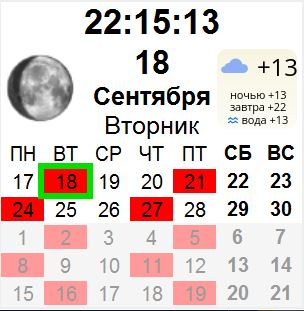

# Виджет &laquo;КАЛЕНДАРЬ&raquo;

## Задачи
 - визуальное отображене графика смен (событий дня) на календаре
 - отдельное приложение работающие под windows
 - переодическое обновление информации
 - дополнительно отображение:
   - текущего числа
   - цифровых часов
   - фазы луны
   - погоды
   
## Реализация

### Серверная часть (реализована на PHP)
- опрос google календаря, выборка дней с событиями на весь день и отметкой занятости
- опрос html виджета для сайта с фазой луны  - получение фазы луны
- формирование ответа с данными

### Пользовательская часть
 - использована технология HTML Application для отображения страницы без браузера
 - формирование HTML виджета средствами JS
 - генерация календаря на основе данных полученных с сервера 
 - получение данных с сервера без перезагрузки страницы
 - регулярная проверка связи с сервером
 - регулярная проверка корректности даты
 
 ## Версии
  1.  использована технология iframe для загрузки страницы с сервера, обновление перезагрузкой страницы hta
  2.  переработана загрузка с сервера на JS блока HTML без перезагрузки
  3.  перенос генерации кода виджета на клиентскую часть JS, на стророне сервера формируется строка с датами событий.
  
 ## Примечания
 
 Методы и реализации адаптированы для работы под HTA, 
 в связи с особенностями поддержки не все современные 
 методы разработки получилось реализовать в этом 
 небольшом проекте.
 